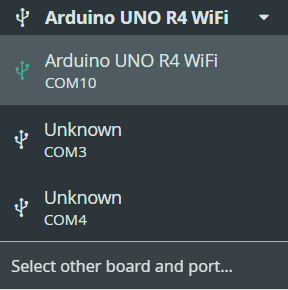
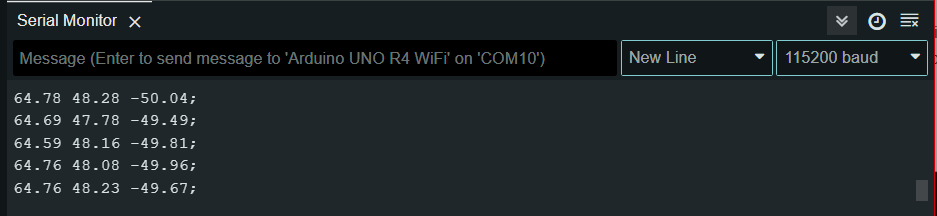

# GoatLab-ArduinoTextWriter

## Instructions

### Install PySerial

Make sure in which ever IDE you are using, you have both an updated version of Python and PySerial Installed. If you do not have Python, the download can be found [here](https://www.python.org/downloads/). For a video installation, watch [this](https://youtu.be/yivyNCtVVDk?si=aBHlGkbYwObR6SLw)
After installing python and using your IDE of choice, open terminal and type: 
```
pip install pyserial
```
And now you can run the code!

### Set Up the the Arduino IDE 

First, open the magsensor_modified file in the Arduino IDE.

Make sure to install the proper board managers and libraries! For this project, we used an Arduino UNO R4 WiFi, so we had to install the 'Arduino UNO R4 Boards' via the Arduino Board Manager and the 'Adafruit MMC56x3' library from Adafruit.

Now, we need to select the correct board and port. Be sure to take note of this step—for this example, I am using the Arduino UNO R4 WiFi on port COM10.

<center>

</center>

Now, if you want, you can upload the program and click on 'Serial Monitor' in the top right. A new tab should open at the bottom of the screen, and from there, you can choose the baud rate. We get this number from the code above.

```
Line 13: Serial.begin(115200);
```

<center>

</center>

Now, leaving everything plugged in, you can close Arduino.

### Setting up the Python file
Now we open ArduinoTextWriter.py in our IDE and place the port and baud rate noted earlier! 

```
# # serial.Serial('COMXX',baud rate)
ser = serial.Serial(port='COM10',baudrate=115200)
```

And bam! You are done!

### Additional Resources
- [MMC56x3 Documentation](https://cdn-learn.adafruit.com/downloads/pdf/adafruit-mmc5603-triple-axis-magnetometer.pdf)
- [Python serial port communication using PySerial](https://www.youtube.com/watch?v=Kr1RyK6WENQ&)